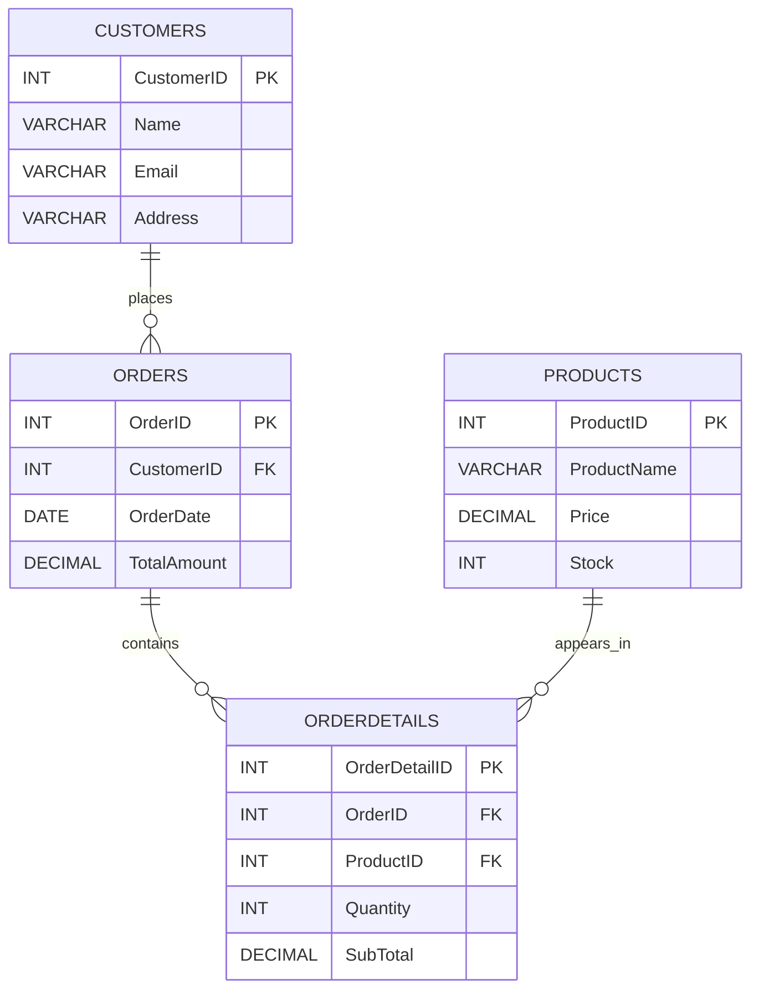
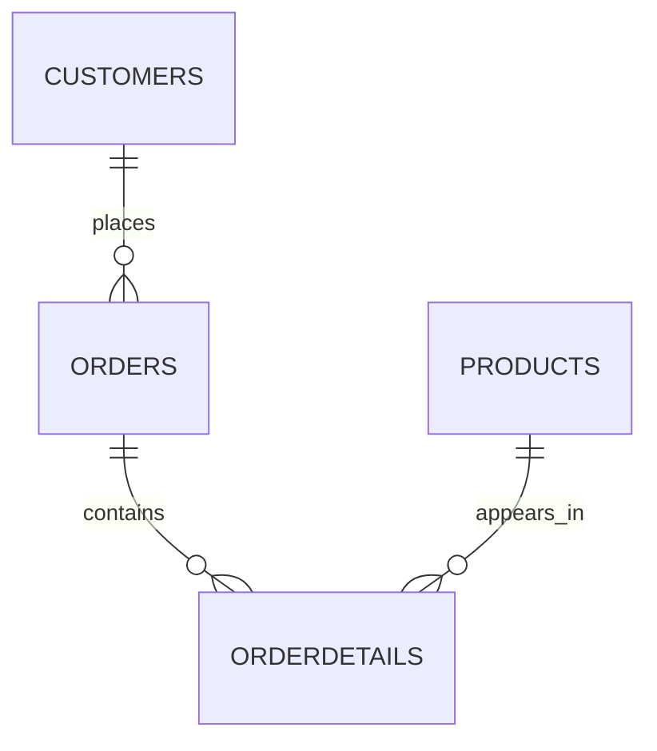

# Data Digger — SQL Project

## Project Structure

```text
DataDigger/
├── DataDigger.sql
├── README.md
├── ER_DIAGRAM.md
├── PROJECT_REPORT.md
└── .gitignore
````

---

# README.md

# Data Digger — SQL Project

## Project Overview

**Data Digger** is a practical MySQL project based on an E-Commerce Store database.

The project demonstrates:

* Database creation
* Table creation
* Primary keys
* Foreign keys
* CRUD operations
* Sorting
* Filtering
* Date-based queries
* Aggregate functions
* JOIN
* GROUP BY
* LIMIT

The database contains four relational tables:

1. Customers
2. Orders
3. Products
4. OrderDetails

---

## Objective

The objective of this project is to gain practical experience in managing a MySQL database using SQL operations, clauses, operators, aggregate functions, primary keys, and foreign keys.

---

## Technologies Used

* **Database:** MySQL
* **Language:** SQL
* **Database Tool:** MySQL Workbench / MySQL Server
* **Repository:** GitHub

---

# Database Tables

## 1. Customers

| Column     | Data Type    | Constraint                  | Description        |
| ---------- | ------------ | --------------------------- | ------------------ |
| CustomerID | INT          | Primary Key, Auto Increment | Unique customer ID |
| Name       | VARCHAR(100) | NOT NULL                    | Customer name      |
| Email      | VARCHAR(100) | NOT NULL                    | Customer email     |
| Address    | VARCHAR(255) | NOT NULL                    | Customer address   |

---

## 2. Orders

| Column      | Data Type     | Constraint                  | Description                   |
| ----------- | ------------- | --------------------------- | ----------------------------- |
| OrderID     | INT           | Primary Key, Auto Increment | Unique order ID               |
| CustomerID  | INT           | Foreign Key                 | Customer who placed the order |
| OrderDate   | DATE          | NOT NULL                    | Date of order                 |
| TotalAmount | DECIMAL(10,2) | NOT NULL                    | Total order amount            |

---

## 3. Products

| Column      | Data Type     | Constraint                  | Description       |
| ----------- | ------------- | --------------------------- | ----------------- |
| ProductID   | INT           | Primary Key, Auto Increment | Unique product ID |
| ProductName | VARCHAR(100)  | NOT NULL                    | Product name      |
| Price       | DECIMAL(10,2) | NOT NULL                    | Product price     |
| Stock       | INT           | NOT NULL                    | Available stock   |

---

## 4. OrderDetails

| Column        | Data Type     | Constraint                  | Description            |
| ------------- | ------------- | --------------------------- | ---------------------- |
| OrderDetailID | INT           | Primary Key, Auto Increment | Unique order-detail ID |
| OrderID       | INT           | Foreign Key                 | Related order          |
| ProductID     | INT           | Foreign Key                 | Related product        |
| Quantity      | INT           | NOT NULL                    | Quantity ordered       |
| SubTotal      | DECIMAL(10,2) | NOT NULL                    | Item subtotal          |

---

# ER Diagram



---

# Relationships

### Customers → Orders

One customer can place many orders.

```text
Customers 1 -------- N Orders
```

### Orders → OrderDetails

One order can contain multiple order-detail records.

```text
Orders 1 -------- N OrderDetails
```

### Products → OrderDetails

One product can appear in multiple order-detail records.

```text
Products 1 -------- N OrderDetails
```

`OrderDetails` connects orders and products and stores quantity and subtotal information.

---

# Assignment Requirements Covered

## Customers

* Insert at least 5 customers
* Retrieve all customer details
* Update a customer's address
* Delete a customer using CustomerID
* Display customers whose name is Alice

## Orders

* Insert at least 5 orders
* Retrieve orders made by a specific customer
* Update an order's total amount
* Delete an order using OrderID
* Retrieve orders placed in the last 30 days
* Find highest, lowest and average order amounts

## Products

* Insert at least 5 products
* Sort products by price in descending order
* Update product price
* Delete a product if it is out of stock
* Retrieve products between ₹500 and ₹2000
* Find the most expensive product
* Find the cheapest product

## OrderDetails

* Insert at least 5 records
* Retrieve details for a specific order
* Calculate total revenue using SUM()
* Find top 3 most ordered products
* Count how many times a product has been sold using COUNT()

---

# How to Run

1. Install MySQL.
2. Open MySQL Workbench.
3. Open `DataDigger.sql`.
4. Execute the complete SQL script.
5. The database `DataDigger` will be created.
6. Four tables will be created.
7. Sample data will be inserted.
8. Required queries will be executed.

---

# Important Foreign Key Note

`OrderDetails` depends on `Orders`, and `Orders` depends on `Customers`.

Therefore, when deleting a related record, the child record should be deleted first.

Example:

```sql
DELETE FROM OrderDetails
WHERE OrderID = 5;

DELETE FROM Orders
WHERE OrderID = 5;

DELETE FROM Customers
WHERE CustomerID = 5;
```

This prevents foreign-key constraint errors.

---

# Assumptions

1. MySQL is used as the database management system.
2. Sample customer and product data is fictional.
3. Monetary values are stored using `DECIMAL(10,2)`.
4. `CURDATE()` is used for date-based queries.
5. Product 5 is intentionally out of stock to demonstrate the deletion requirement.
6. Foreign-key relationships are maintained.
7. The project is intended for educational purposes.

---

# Repository Structure

```text
DataDigger/
│
├── DataDigger.sql
│
├── README.md
│
├── ER_DIAGRAM.md
│
├── PROJECT_REPORT.md
│
└── .gitignore
```
# ER_DIAGRAM.md

# Data Digger — ER Diagram

## Entity Relationship Diagram


## Entities

### Customers

The Customers table stores information about people who purchase products.

**Primary Key:**

```text
CustomerID
```

Attributes:

```text
CustomerID
Name
Email
Address
```

---

### Orders

The Orders table stores information about customer orders.

**Primary Key:**

```text
OrderID
```

**Foreign Key:**

```text
CustomerID
```

The foreign key references:

```text
Customers(CustomerID)
```

Attributes:

```text
OrderID
CustomerID
OrderDate
TotalAmount
```

---

### Products

The Products table stores information about products available in the store.

**Primary Key:**

```text
ProductID
```

Attributes:

```text
ProductID
ProductName
Price
Stock
```

---

### OrderDetails

The OrderDetails table stores individual products belonging to each order.

**Primary Key:**

```text
OrderDetailID
```

**Foreign Keys:**

```text
OrderID
ProductID
```

Relationships:

```text
OrderID → Orders(OrderID)

ProductID → Products(ProductID)
```

Attributes:

```text
OrderDetailID
OrderID
ProductID
Quantity
SubTotal
```

---

# Cardinality

```text
Customers
    |
    | 1 : N
    ↓
Orders
    |
    | 1 : N
    ↓
OrderDetails
    ↑
    |
    | N : 1
    |
Products
```

## Relationship Explanation

### Customers and Orders

One customer can place multiple orders.

```text
One Customer → Many Orders
```

### Orders and OrderDetails

One order can contain multiple products.

```text
One Order → Many OrderDetails
```

### Products and OrderDetails

One product can occur in many orders.

```text
One Product → Many OrderDetails
```

---

# PROJECT_REPORT.md

# DATA DIGGER

## SQL PROJECT REPORT

### E-Commerce Store Database

---

# 1. Introduction

Data Digger is a practical SQL database project developed for an E-Commerce Store.

The project demonstrates the design and implementation of a relational database using MySQL.

The database consists of four related tables:

* Customers
* Orders
* Products
* OrderDetails

The project demonstrates fundamental SQL concepts including CRUD operations, filtering, sorting, aggregate functions, primary keys, foreign keys, JOIN, GROUP BY and date-based queries.

---

# 2. Objective

The main objective of the project is to develop practical knowledge of SQL and relational database management.

The project focuses on:

1. Creating a MySQL database.
2. Creating relational tables.
3. Defining primary keys.
4. Defining foreign keys.
5. Inserting records.
6. Retrieving records.
7. Updating records.
8. Deleting records.
9. Sorting records.
10. Filtering records.
11. Using aggregate functions.
12. Joining related tables.
13. Grouping data.
14. Handling foreign-key relationships.

---

# 3. Project Scope

The project represents a basic E-Commerce Store.

Customers can place orders.

Orders can contain multiple products.

The OrderDetails table stores the individual products and quantities belonging to each order.

The database provides a simple structure for storing and analyzing e-commerce information.

---

# 4. Database Tables

## Customers

Stores customer information.

```text
CustomerID
Name
Email
Address
```

## Orders

Stores customer order information.

```text
OrderID
CustomerID
OrderDate
TotalAmount
```

## Products

Stores information about products.

```text
ProductID
ProductName
Price
Stock
```

## OrderDetails

Stores products included in orders.

```text
OrderDetailID
OrderID
ProductID
Quantity
SubTotal
```

---

# 5. Primary Keys

The following primary keys are used:

```text
Customers.CustomerID
Orders.OrderID
Products.ProductID
OrderDetails.OrderDetailID
```

Primary keys uniquely identify each record in a table.

---

# 6. Foreign Keys

The project uses the following foreign keys:

```text
Orders.CustomerID
        ↓
Customers.CustomerID
```

```text
OrderDetails.OrderID
        ↓
Orders.OrderID
```

```text
OrderDetails.ProductID
        ↓
Products.ProductID
```

Foreign keys establish relationships between tables and help maintain referential integrity.

---

# 7. ER Diagram



---

# 8. CRUD Operations

## Create

Records are added using:

```sql
INSERT INTO
```

Example:

```sql
INSERT INTO Customers
(Name, Email, Address)
VALUES
('Alice', 'alice@gmail.com', 'Mumbai, Maharashtra');
```

---

## Read

Records are retrieved using:

```sql
SELECT
```

Example:

```sql
SELECT *
FROM Customers;
```

---

## Update

Existing records are modified using:

```sql
UPDATE
```

Example:

```sql
UPDATE Customers
SET Address = 'Nagpur, Maharashtra'
WHERE CustomerID = 2;
```

---

## Delete

Records are removed using:

```sql
DELETE
```

Example:

```sql
DELETE FROM Products
WHERE ProductID = 5
AND Stock = 0;
```

---

# 9. Sorting

Products can be sorted by price using:

```sql
SELECT *
FROM Products
ORDER BY Price DESC;
```

This displays products from highest price to lowest price.

---

# 10. Filtering

Products between ₹500 and ₹2000 are retrieved using:

```sql
SELECT *
FROM Products
WHERE Price BETWEEN 500 AND 2000;
```

---

# 11. Date-Based Query

Orders placed during the last 30 days can be retrieved using:

```sql
SELECT *
FROM Orders
WHERE OrderDate >= CURDATE() - INTERVAL 30 DAY;
```

`CURDATE()` returns the current date.

---

# 12. Aggregate Functions

The project demonstrates several SQL aggregate functions.

## SUM()

Used to calculate total revenue.

```sql
SELECT SUM(SubTotal) AS TotalRevenue
FROM OrderDetails;
```

## MAX()

Used to find the highest order amount.

```sql
SELECT MAX(TotalAmount)
FROM Orders;
```

## MIN()

Used to find the lowest order amount.

```sql
SELECT MIN(TotalAmount)
FROM Orders;
```

## AVG()

Used to calculate the average order amount.

```sql
SELECT AVG(TotalAmount)
FROM Orders;
```

## COUNT()

Used to count how many times a product occurs in order-detail records.

```sql
SELECT COUNT(*)
FROM OrderDetails
WHERE ProductID = 2;
```

---

# 13. JOIN Operation

The project uses JOIN to combine order details with product information.

```sql
SELECT
    od.OrderDetailID,
    od.OrderID,
    p.ProductName,
    od.Quantity,
    od.SubTotal
FROM OrderDetails od
JOIN Products p
    ON od.ProductID = p.ProductID
WHERE od.OrderID = 1;
```

This allows product names to be displayed together with order-detail information.

---

# 14. GROUP BY and Top 3 Products

The project uses `GROUP BY` to calculate total quantities ordered for each product.

```sql
SELECT
    p.ProductID,
    p.ProductName,
    SUM(od.Quantity) AS TotalQuantityOrdered
FROM OrderDetails od
JOIN Products p
    ON od.ProductID = p.ProductID
GROUP BY
    p.ProductID,
    p.ProductName
ORDER BY
    TotalQuantityOrdered DESC
LIMIT 3;
```

This produces the top three products based on total quantity ordered.

---

# 15. Sample Data

The project contains five sample customers:

```text
Alice
Rahul
Priya
Amit
Neha
```

The project contains five sample products:

```text
Wireless Mouse
Mechanical Keyboard
USB-C Charger
Laptop Stand
Webcam
```

The Webcam is intentionally assigned:

```text
Stock = 0
```

This allows the out-of-stock deletion operation to be demonstrated.

Five sample orders are also inserted.

---

# 16. Foreign Key Handling

Foreign-key relationships require dependent records to be handled correctly.

For example, an order cannot safely be removed while an OrderDetails record still refers to it.

Therefore:

```sql
DELETE FROM OrderDetails
WHERE OrderID = 5;
```

is performed before:

```sql
DELETE FROM Orders
WHERE OrderID = 5;
```

After the order is removed, the related customer can be deleted if required.

This demonstrates correct handling of referential integrity.

---

# 17. Assumptions

The following assumptions were made:

1. MySQL is used for the project.
2. Sample data is fictional.
3. CustomerID uniquely identifies customers.
4. OrderID uniquely identifies orders.
5. ProductID uniquely identifies products.
6. OrderDetailID uniquely identifies order-detail records.
7. Monetary values use two decimal places.
8. `CURDATE()` is used for dynamic date calculations.
9. Product 5 is intentionally out of stock.
10. Foreign-key relationships are respected.
11. The project is intended for educational purposes.

---

# 18. Testing

The following operations should be tested after running the SQL script:

### Test 1

Retrieve all customers.

```sql
SELECT * FROM Customers;
```

### Test 2

Find Alice.

```sql
SELECT *
FROM Customers
WHERE Name = 'Alice';
```

### Test 3

Sort products.

```sql
SELECT *
FROM Products
ORDER BY Price DESC;
```

### Test 4

Find products between ₹500 and ₹2000.

```sql
SELECT *
FROM Products
WHERE Price BETWEEN 500 AND 2000;
```

### Test 5

Find last 30 days' orders.

```sql
SELECT *
FROM Orders
WHERE OrderDate >= CURDATE() - INTERVAL 30 DAY;
```

### Test 6

Calculate total revenue.

```sql
SELECT SUM(SubTotal)
FROM OrderDetails;
```

### Test 7

Find highest order amount.

```sql
SELECT MAX(TotalAmount)
FROM Orders;
```

### Test 8

Find lowest order amount.

```sql
SELECT MIN(TotalAmount)
FROM Orders;
```

### Test 9

Find average order amount.

```sql
SELECT AVG(TotalAmount)
FROM Orders;
```

### Test 10

Find top three products.

```sql
SELECT
    p.ProductName,
    SUM(od.Quantity) AS TotalQuantity
FROM OrderDetails od
JOIN Products p
    ON od.ProductID = p.ProductID
GROUP BY p.ProductID, p.ProductName
ORDER BY TotalQuantity DESC
LIMIT 3;
```

---

# 19. Expected Learning Outcomes

After completing this project, the student should be able to:

* Understand relational database design.
* Create databases and tables using SQL.
* Define primary keys.
* Define foreign keys.
* Insert records.
* Retrieve records.
* Update records.
* Delete records.
* Filter data.
* Sort data.
* Work with dates.
* Use aggregate functions.
* Use JOIN.
* Use GROUP BY.
* Use ORDER BY.
* Use LIMIT.
* Understand referential integrity.

---

# 20. Advantages of the Project

The Data Digger database provides:

* Simple relational structure
* Easy data management
* Data consistency through keys
* Efficient retrieval of information
* Product and order analysis
* Revenue calculation
* Product popularity analysis
* Practical SQL learning

---

# 21. Limitations

This is an educational project and therefore has a simplified design.

Possible future improvements include:

* Payment table
* Shipping table
* Product categories
* Customer phone numbers
* Order status
* Multiple addresses
* Discount and coupon system
* Product reviews
* Inventory transaction history
* User authentication

---

# 22. Future Scope

The project can be extended into a complete E-Commerce Management System.

Future versions could include:

```text
Customers
    ↓
Orders
    ↓
OrderDetails
    ↓
Products
    ↓
Categories

Orders
    ↓
Payments

Orders
    ↓
Shipping

Products
    ↓
Reviews
```

A web or mobile application could also be connected to the database.

---

# 23. Conclusion

The Data Digger project demonstrates the fundamental concepts of relational databases and SQL using an E-Commerce Store example.

The project successfully implements four related tables:

```text
Customers
Orders
Products
OrderDetails
```

It demonstrates CRUD operations, filtering, sorting, date queries, aggregate functions, JOIN, GROUP BY, primary keys and foreign keys.

The project provides practical experience in designing and manipulating relational database systems using MySQL.

---
